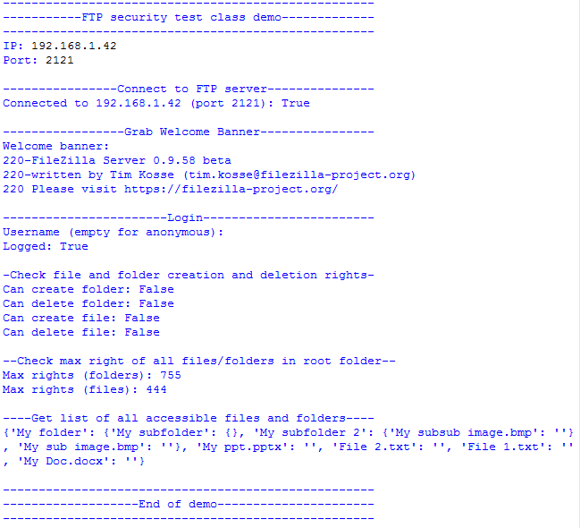

# FTP scanner
 

## What is it

This python tool library is designed to check if a FTP(S) server is secured or not
and the kind of information and rights you have with or without credentials.

It is multi-platform and compatible with python 2.7+ and 3+.

## Examples

<a target="_blank" href="https://github.com/QuentinCG/FTP-Security-Scanner/blob/master/utils/ftp.py">Scan one IP with a specific port:</a>

## How to install

This tool only needs python (without extra library).

1) Download this repository

2) Launch the Python file like this to check your FTP server and follow instructions: `python ftp.py` command

## What is checked with this tool

For every scanned IP:
  - Is FTP port open?
  - Is it possible to log in the FTP server as anonymous user (or with specific login and password)?
  - If connected:
    - Grab the welcome banner (can contain information of deprecated FTP(s) servers)
  - If logged in:
    - Grab full or partial list of accessible files and folders in the server
    - Check write/read rights on file/folder
    - Check Unix permissions on root folders and files (000 to 777)

## License

This project is under MIT license. This means you can use it as you want (just don't delete the library header).

## Contribute

If you want to add more examples or improve the library, just create a pull request with proper commit message and right wrapping.
